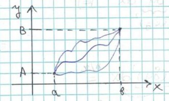

# Глава 1 Элементарное введение в вариационное исчисление

## §1. Основные понятия.

Вариационное исчисление связано с поиском экстремума некоторого функционала (по сути является функцией от функции)

Пусть $V$ - ЛНП (над полем $\mathbb{R}$) с нормой $||y||$:
    1. $||y|| \geq 0$, причем $||y|| = 0 \iff y = \theta$
    2. $\forall \alpha \in \mathbb{R} \implies ||\alpha y|| = |\alpha| \cdot ||y||$
    3. $\forall z, y \in \mathbb{R} \implies ||z + y|| \leq ||z|| + ||y||$

Для пространства $C\left(\left[a; b\right]\right)$: $||y|| = \max|y\left(x\right)|$, $x \in \left[a; b\right]$
    Для пространства $C^1\left(\left[a;b\right]\right)$: $||y|| = \max\left\{\max|y\left(x\right)|, \max|y\left(x\right)|\right\}$, $x \in \left[a; b\right]$ или $||y|| = \max|y\left(x\right)| + \max|y'\left(x\right)|$, $x \in \left[a; b\right]$
    Аналогично вводится норма $C^n\left(\left[a;b\right]\right)$, где $n \geq 2$

<u>Опр.1</u> Эпсилон окрестность точки $y_0$ - множество точек таких, что
$\left\{y\left(x\right) \in V \mid ||y\left(x\right) - y_0\left(x\right)|| < \epsilon\right\}$
    Окрестность в $C$ называется сильной окрестностью, в $C^n$ ($\forall n\geq 1$) называется слабой окрестностью.

<u>Замечание:</u> В слабую окрестность попадают функции с близкими значениями и с близкими значениями производных. В сильную же - только с близкими значениями. То есть в слабой окрестности функций меньше.

<u>Опр.2</u> Функционалом $J$ называется закон(правило), по которому каждому элементу $y \in V$ (или $M \subset V$) ставится в соответствие действительное число(точка $\equiv$ кривой)
    Обозначение: $J\left[y\right]$
    Пример: $J\left[y\right] = \int_{a}^{b} y\left(x\right) \, dx$ на $C\left(\left[a;b\right]\right)$, ...

<u>Опр.3</u> Функционал называется линейным на $M$, если:
    $\forall y_1\left(x\right), y_2\left(x\right) \in M$ и $\forall \alpha_1, \alpha    _2 \in \mathbb{R} \implies J\left[\alpha_1 y_1\left(x\right) + \alpha_2 y_2\left(x\right)\right] = \alpha_1 J\left[y_1\right] + \alpha_2 J\left[y_2\right]$ 

<u>Опр.4</u> Будем говорить, что $J\left[y\right]$ достигает локального максимума в точке $y_0$ (на кривой $y_0\left(x\right)$), если:
    $\exists U_\epsilon \left(y_0\right) = \left\{y \in M \mid ||y - y_0|| < \epsilon\right\}$: $\forall y\left(x\right) \in U_\epsilon \left(y_0\right) \implies J\left[y_0\right] \geq J\left[y\right]$

Если $U_\epsilon \left(y_0\right)$ - сильная, то такой максимум называется сильным.
    Если $U_\epsilon \left(y_0\right)$ - слабая, то такой максимум называется слабым.
    <u>Замечание:</u> Каждый сильный максимум является слабым, но не наоборот.

<u>Опр.5</u> Аналогичные выкладки справедливы для локального минимума.

<u>Опр.6</u> Точки локального $\max$ и $\min$ называется точками экстремума (экстремальными кривыми)

<u>Опр.7</u> Вариацией кривой $y\left(x\right) \in M$ называется произвольное приращение этой кривой.
    Обозначение: $\delta y = \widetilde{y}\left(x\right) - y\left(x\right)$, если $y\left(x\right) \in M \rightarrow \widetilde{y}\left(x\right) \in M$

<u>Замечание:</u> Далее рассматриваем только допустимые вариации, т.е. такие, что: $y\left(x\right) + \delta\left(y\right) \in M$, если $y\left(x\right) \in M$

<u>Опр.8</u> Пусть кривой $y_0\left(x\right)$ дали приращение $\delta y$. Тогда рассмотрим разность: $J\left[y_0 + \delta y\right] - J\left[y_0\right] = \Delta J\left[y_0\right]$
    Если приращение функционала J\left[y\right] в точке $y_0$ можно представить в виде: $\Delta J\left[y_0\right] = L\left[y_0, \delta y\right] + o\left(||\delta y||\right)$, где $L$ - линейный оператор по 2-ому аргументу, тогда функционал $J$ называется <u>дифференцируемым</u> по Фреше в точке $y_0$, а линейная часть приращения $L\left[y_0, \delta y\right]$ называется вариацией функционала $J$ в точке $y_0$.
    <u>Замечание:</u> Дифференцируем по Фреше $\equiv$ дифференцируем в широком смысле.
    Обозначение: $\delta J\left[y_0\right] \equiv L\left[y_0, \delta y\right]$

<u>Опр.9</u> Eсли $\exists \frac{d}{d\alpha} \left( J\left[y_0 + \alpha \delta y\right] \right) \mid_{\alpha=0}$, то $J\left[y\right]$ называется дифференцируемым по Гато в точке $y_0$, а значение этой производной называется вариацией по Гато.
    <u>Замечание:</u> Диф. по Фреше $\implies$ диф. по Гато. В общем случае обратное неверно, но в дальнейшем для интегральных функицоналов эти понятия тождественны, поэтому для упрощения понимания, будем пользоваться определением по Гато.

<u>Т1</u> (Необходимое условие экстремума)
    (Функционал $J\left[y\right]$ достигает экстремума во внтуренней точке $y_0$ множества $M$) $\implies$ ($\delta J\left[y_0\right] = 0$)

$\Delta$: Пусть для определенности достигается $\min$, тогда:
    $\exists U_\epsilon \left(y_0\right)$: $\forall y\left(x\right) \in U_\epsilon  \left(y_0\right) \implies J\left[y\right] \geq J\left[y_0\right]$
    Пусть $\delta y$ - произвольное приращение (допустимое). Возьмем $\alpha>0$: $|\alpha| < \frac{\epsilon}{||\delta y||}$
    Тогда: $J\left[y_0 + \alpha \cdot \delta y\right] \geq J\left[y_0\right]$

Рассмотрим $f\left(\alpha\right) = J\left[y_0 + \alpha \cdot \delta y\right]$.Тогда
$$\left(\forall \alpha \left(|\alpha| < \frac{\epsilon}{||\delta y||} \implies f\left(\alpha\right) \geq f\left(0\right)\right)\right) \implies \left(\min f\left(\alpha\right) = f\left(\alpha = 0\right)\right)$$
    Знаем, что $J\left[y\right]$ дифференцируем в точке $y_0$, т.е.:
$$\exists \frac{d}{d\alpha} \left( J\left[y_0 + \alpha \cdot \delta y\right] \mid_{\alpha = 0} \right) \implies \left(\exists f'\left(0\right)\right)$$
    Из курса математического анализа: $f'\left(0\right) = 0$
    Но $\left(f'\left(0\right) = \delta J\left[y_0\right]\right)$. Тогда: $\delta J\left[y_0\right] = 0$

Аналогично доказывается для максимума.
$\square$

<u>Замечание:</u> <u>Т1</u> является необходимым условием для слабого экстремума, а следовательно, и для сильного экстремума.

## §2. Простейшая задача вариационного исчисления.

    Рассмотрим $M = \left\{y \in C^1\left(\left\{a;b\right\}\right) : y\left(a\right) = A; y\left(b\right) = B\right\}$
    Рассмотрим функционал (1) $J\left[y\right] = \int_{a}^{b} F\left(x, y, y'\right) \, dx$
    $F(x, y, p$ - заданная функция, будем считать ее непрерывной.
    Функционал $J\left[y\right]$ называется функционалом с закрепленными концами.
    Задача нахождения экстремума функционала (1) на множестве $M$ (гладкая кривая с закрепленными концами) называется простейшей задачей вариационного ичисления.
    Что значит условие $\delta J\left[y\right] = 0$, для функционала (1) с закрепленными концами:
    $y\left(a\right) = A$, $y\left(b\right) = B$
    <u>Замечание:</u>
    1. Все допустимые вариации удовлетворяют условию: $\delta y\left(a\right) = \delta y\left(b\right) = 0$
    2. $\left(\delta y\right)' = \left(\widetilde{y} - y\right)' = \widetilde{y}' - y' = \delta y'$
    
Рассмотрим вариацию по Гато:
    $\frac{d}{d\alpha} \left( J\left[y + \alpha \cdot \delta y\right] \right) = \frac{d}{d \alpha} \left( \int_{a}^{b} F\left(x, y + \alpha \cdot \delta y, y' + \alpha \cdot \delta y'\right) \, dx \right) =$ (2)
    Будем считать, что $F\left(x, y, p\right)$ непрерывна с частными производными до 2-ого порядка.
    $J$ - собственный интеграл, зависящий от параметра, тогда:
    (2) $= \int_{a}^{b} \left(F_y ' \left(x, y + \alpha \cdot\delta y, y' + \alpha \cdot \delta y\right) \delta y + F_p ' \left(x, y + \alpha \cdot \delta y, y' + \alpha \cdot \delta y'\right) \delta y'\right)\, dx$
    Рассмотрим второй интеграл:
    $\int_{a}^{b} F_p ' \left(x, y + \alpha \cdot \delta y, y; + \alpha \cdot \delta y'\right)\left(\delta y\right)' \, dx = F_p '\left(x, y + \alpha \cdot \delta y, y' + \alpha \delta y'\right) \delta y \mid_a^b - \int_{a}^{b} \delta y \cdot \frac{d}{dx} \left( F_p ' \left(x, y +\alpha \cdot \delta y, y' + \alpha \delta y'\right) \right) \, dx$
    Тогда (2) $= \int_{a}^{b} \left(F_y '\left(x, y + \alpha \cdot \delta y, y' + \alpha \cdot \delta y'\right) - \frac{d}{dx} \left( F_p '\left(x, y + \alpha \cdot \delta y, y' + \alpha \cdot \delta y'\right) \right)\right) \cdot \delta y \, dx$

Полагаем, что $\alpha = 0$. Тогда:
    $\int_{a}^{b} \left(F_y '\left(x, y, y'\right) - \frac{d}{dx} \left( F_p ' \left(x, y, y'\right) \right)\right) \delta y \, dx = 0$
    Отсюда получаем следующее:
    $F_y ' \left(x, y, y'\right) - \frac{d}{dx} \left( F_p ' \left(x, y, y'\right) \right) = 0$
    Обоснуем этот переход ниже:
# to be continued...
