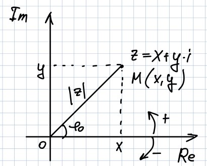

# Глава 1. Комплексные числа, последовательности и ряды. Расширенная комплексная плоскость. Функции комплексного переменного. Кривые на комплексной плоскости.

## §1. Комплексные числа и операции над ними.
<u>Опр.1</u> Мн-во $\left\{ \left(a, b\right) | a, b \in \mathbb{R} \right\}$ и введем операции:
    "+": $\left(a_1, b_1\right) + \left(a_2, b_2\right) = \left(a_1 + a_2, b_1 + b_2\right)$
    "$\cdot$": $\left(a_1, b_1\right) \cdot \left(a_2, b_2\right) = \left(a_1\cdot a_2 - b_1 \cdot b_2, a_1 \cdot b_2 + a_2 \cdot b_1 \right)$

Это множество с таким образом введенными операциями сложения и умножения будем называть множеством комплексных чисел. (К. Ч.), $\mathbb{C}$

<u>Алгебраическая форма записи К.Ч.</u>
    Рассмотрим числа вида: $\left(a_i, 0\right) \forall a_i \in \mathbb{R}$
    $\left(a_1, 0\right) + \left(a_2, 0\right) = \left(a_1 + a_2, 0\right)$
    $\left(a_1, 0\right) \cdot \left(a_2, 0\right) = \left(a_1 \cdot a_2, 0 \right)$
    Числа вида $\left(a, 0\right)$ ведут себя как $\mathbb{R}$, $\left(a, 0\right) = a = a \cdot \left(1, 0\right)$; $\left(1, 0\right) = 1$
    Рассмотрим $\left(0, b\right) = b \cdot \left(0, 1\right) = \left(b, 0\right) \cdot \left(0, 1\right) = \left(0, b\right)$
    $b \in \mathbb{R}$, $\left(0, 1\right) = i \implies \left(0, 1\right) \cdot \left(0, 1\right) = i^2 = -1$
    $z = \left(a, b\right) = \left(a, 0\right) + \left(0, b\right) = a\cdot\left(1, 0\right) + b\cdot i =a + bi$
    $a = Re z, b = Im z$
    $\left(a_1 + b_1 i\right) + \left(a_2 + b_2 i\right) = \left(a_1 + a_2\right) + \left(b_1 + b_2\right) i$
    $\left(a_1 + b_1 i\right) \cdot \left(a_2 + b_2 i\right) = \left(a_1 a_2 - b_1 b_2\right) + \left(a_1 b_2 + a_2 b_1\right) i$
    $\forall z = a + b i$, $\bar{z} = a - bi$
    $z \cdot \bar{z} = \left(a + b i\right) \cdot \left(a - b i \right) = a^2 - \left(b \cdot i\right)^2 = a^2 + b^2 = |z|^2$, $|z| = \sqrt{a^2 + b^2} \geq 0$

<u>Деление:</u>
    $\forall z_1, z_2 \in \mathbb{C}, z_2 \neq 0$  $\exists ! z \in \mathbb{C} z_1 = z_2 \cdot z$
    $z$ - частное $z_1$ и $z_2$, $z = \frac{z_1}{z_2}$
    $z_1 = a_1 + b_1 i$, $z_2 = a_2 + b_2 i \neq 0 \implies z_2 \neq 0 + 0 i$, $z = x + y i = ?$
    $\left(a_1 + b_1 i\right) = \left(a_2 + b_2 i\right) \left(x + y i\right)$
    $\left(a_2 x - b_2 y = a_1\right) \wedge \left(b_2 x + a_2 y = b_1\right)$ - СЛАУ
    $\Delta = a_2 ^ 2 + b_2 ^ 2 = |z_2|^2 \neq 0 \implies \exists !$ реш. СЛАУ
    $\Delta_x = a_1 a_2 + b_1 b_2$, $x = \frac{\Delta_x}{\Delta}$
    $\Delta_y = a_2 b_1 - a_1 b_2$, $y = \frac{\Delta_y}{\Delta}$

$$z = x + y i = \frac{1}{|z_2|^2} \left(a_1 a_2 + b_1 b_2 + \left(a_2 b_1 - a_1 b_2\right) i \right) = \frac{z_1}{z_2} = \frac{z_1 \cdot \bar{z_2}}{|z_2|^2}$$

### Основные свойства операций сложения и умножения для комплексных чисел.

$\forall z_1, z_2, z_3 \in \mathbb{C}$
- **Сложение:**

    1. $z_1 + z_2 = z_2 + z_1$ (коммутативность)
    2. $\left(z_1 + z_2\right) + z_3 = z_1 + \left(z_2 + z_3\right)$ (ассоциативность)
    3. $\exists 0 \in \mathbb{C}$ $\forall z \in \mathbb{C}$ $z + 0 = z$
    4. $\forall z \in \mathbb{C}$ $\exists ! z_1 \in \mathbb{C}$ $z + z_1 = 0$, $z_1 = (-1) \cdot z$

- **Умножение:**

    5. $z_1 \cdot z_2 = z_2 \cdot z_1$
    6. $z_1 \cdot \left(z_2 \cdot z_3\right) = \left(z_1 \cdot z_2\right) \cdot z_3$
    7. $\exists 1 \in \mathbb{C}$ $\forall z \in \mathbb{C}$ $1 \cdot z = z$
    8. $\forall z \in \mathbb{C}$, $z\neq 0$ $\exists z^{-1} \in \mathbb{C}$: $z \cdot z^{-1} = 1$, $z^{-1} = \frac{\bar{z}}{|z|^2} = \frac{1}{z}$
    9. $\left(z_1 + z_2\right) \cdot z_3 = z_1 \cdot z_3 + z_2 \cdot z_3$

Из выполнения 2-4 следует, что $\mathbb{C}$ - группа по сложению.
    1 $\implies \mathbb{C}$ - абелева группа
    5-8 $\implies \mathbb{C} \setminus \left\{0\right\}$ - мультипликативная группа
    1-9 - поле комплексных чисел

### Геометрическая интерпретация и тригонометрическая форма записи комплексных чисел

$\mathbb{R}^2$: $\left(1, 0\right)$, $\left(0, 1\right)$ - стандартный базис

$|z| =$ расстояние от точки $0$ до точки $z$ на комплексной плоскости.
    $\phi_0 \in \left(-\pi; \pi\right]$
    $z \neq 0$, $|z| = \sqrt{x^2 + y^2} = r \neq 0$
    $z = r \left(\frac{x}{r} + \frac{y}{r} i \right) = r \left(\cos\phi + i \sin\phi \right)$ - тригонометрическая форма записи комплексного числа
    $\phi = \phi_0 + 2 \pi k$, $k \in \mathbb{Z}$
    $\phi$:$\cos\phi = \frac{x}{r}$ $\wedge$ $\sin\phi = \frac{y}{r}$, $\phi_0$ - главное значение аргумента $z$, $\phi_0 = arg z \in \left(-\pi; \pi\right]$
    $Arg z = \left\{\phi = \phi_0 + 2 \pi k, k \in \mathbb{Z}\right\}$
    $z = r \left(\cos\phi + i \sin \phi \right) = r \cdot e^{i\phi}$ - экспоненциальная форма записи

<u>Свойства комплексных чисел, следующие из форм записи:</u>

$\forall z_1, z_2 \in \mathbb{C}$
1. $|z_1 + z_2| \leq |z_1| + |z_2|$
    $\left(|z_1 + z_2| = |z_1| + |z_2|\right) \iff \left(z_1 = \alpha \cdot z_2\right)$, $\alpha \geq 0$
    $|z_1 - z_2| \geq ||z_1| - |z_2||$
    $|Re z| \leq |z| \leq |Re z| + |Im z|$
    $|Im z| \leq |z|$
2. $z = a + b i$, $\bar{z} = a - b i \implies arg \bar{z} = - arg z$ 
3. $|e^{i\phi}| = |\cos\phi + i \sin \phi| = 1$
4. $| z_1 \cdot z_2| = |z_1| \cdot |z_2|$
    $|z^n| = |z| ^ n$
5. $z_1 = r_1 \left(\cos\phi_1 + i \sin \phi_1\right)$, $z_2 = r_2 (\cos \phi_2 + i \sin \phi_2$
    $z_1 \cdot z_2 = r_1 r_2 \left(\cos\left(\phi_1 + \phi_2\right) + i \sin\left(\phi_1 + \phi_2\right)\right)$
    $z_1 \cdot z_2 = r_1 \cdot e^{i\phi_1} \cdot r_2 \cdot e^{i\phi_2} = r_1 r_2 \cdot e^{i\left(\phi_1 + \phi_2\right)}$
    $z_1, z_2 \neq 0$, $\frac{z_1}{z_2} = \frac{r_1}{r_2} \left(\cos\left(\phi_1 - \phi_2\right) + i \sin \left(\phi_1 + \phi_2\right)\right)$
6. $z = r \left(cos\phi + i \sin\phi\right)$, $n \in \mathbb{N}$
    $z^n = r^n\left(\cos n\phi + i \sin n\phi\right)$ - формула Муавра

### Извлечение корня из комплексного числа

<u>Опр.2</u> Пусть $n \in \mathbb{N}$, $z \in \mathbb{C}$, корнем $n$-ой степени из комплексного числа $z$ называется всякое комплексное число $b$: $b^n = z$, т.е. $\sqrt[n]{z}$ - все решения этого уравнения

<u>Утв.</u> Пусть $z \in \mathbb{C} \setminus \left\{0\right\}$. Тогда $\forall n \in \mathbb{N}$ $\exists$ ровно $n$ различных корней $n$-ой степени из комплексного числа $z$. Все эти корни лежат на окружности с центром в точке О и радиусом $R = \sqrt[n]{|z|} > 0$ в вершинах правильного $n$-угольника $\left(n \geq 2\right)$

$\Delta$:

> Рассмотрим $z = r (\cos\phi + i sin\phi)$, $z \neq 0$
> $b \neq 0$, $b = |b| \left(\cos\psi + i\sin\psi\right)$
> $b^n = |b|^n \cdot \left(\cos n\psi + i \sin n\psi\right) = r \left(\cos\phi + i \sin\phi\right) \iff \left(|b|^n = r \wedge \cos n\psi = \cos\phi \wedge \sin n\psi = \sin\phi\right) \iff \left(|b| = \sqrt[n]{r} \wedge n\psi = \phi + 2\pi k, k \in \mathbb{Z}\right)$
> $$\left(\sqrt[n]{z}\right)_k = \sqrt[n]{|z|} \cdot \left(\cos\frac{\phi + 2\pi k}{n} + i \sin\frac{\phi + 2\pi k}{n}\right), k = 0, 1, ..., n-1$$

□
